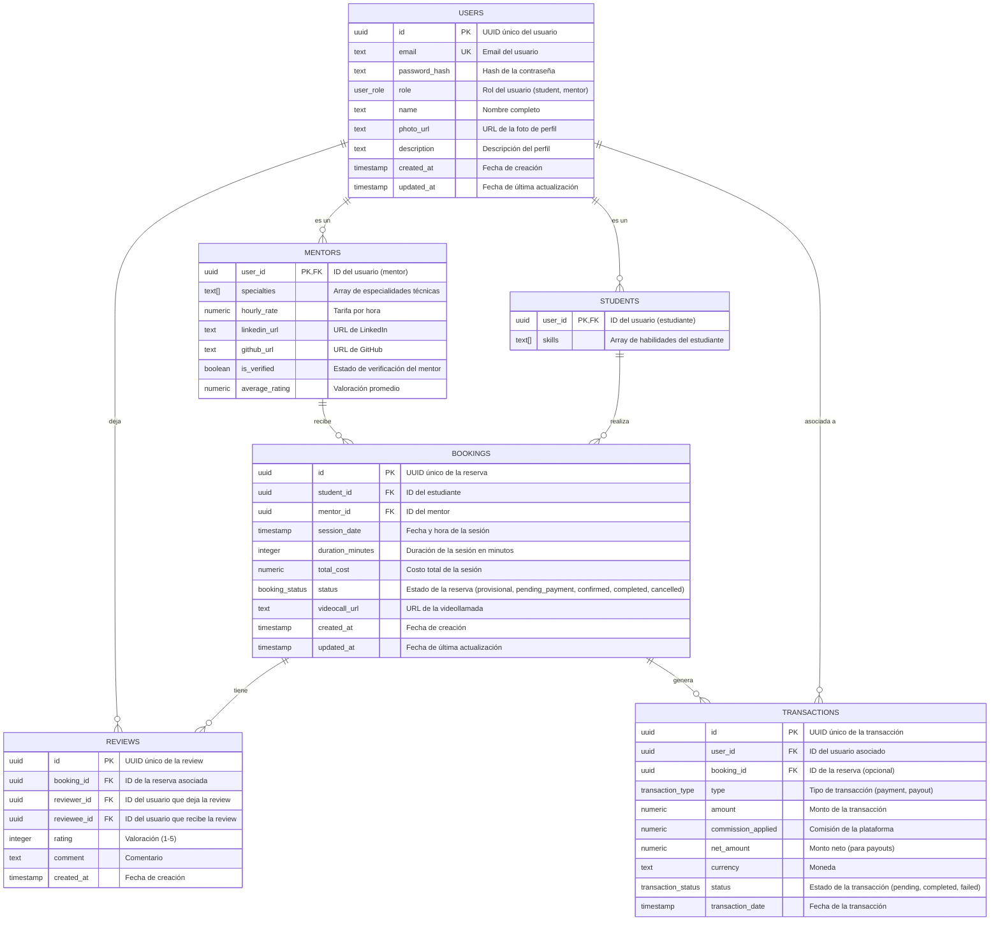

```markdown
# Architecture Specifications: Upex My Mentor

## 1. System Architecture (C4 Level 1-2)

```mermaid
C4Context
    title System Context for Upex My Mentor

    Person(user, "Usuario", "Estudiante o Mentor")
    System(upex_my_mentor, "Upex My Mentor", "Plataforma de marketplace de mentoría tech")
    System_Ext(supabase_auth, "Supabase Auth", "Servicio de autenticación de usuarios")
    System_Ext(supabase_db, "Supabase PostgreSQL DB", "Base de datos relacional para almacenar datos de la plataforma")
    System_Ext(stripe, "Stripe", "Pasarela de pagos para procesar transacciones")
    System_Ext(email_service, "Servicio de Email", "Envío de notificaciones y recordatorios (ej. SendGrid, Resend)")
    System_Ext(video_conferencing, "Servicio de Videoconferencia", "Plataforma para sesiones 1-a-1 (ej. Daily.co, Jitsi, o enlaces externos)")
    System_Ext(github_linkedin, "GitHub/LinkedIn APIs", "Para verificación de credenciales de mentores")

    Rel(user, upex_my_mentor, "Usa")
    Rel(upex_my_mentor, supabase_auth, "Autentica usuarios con")
    Rel(upex_my_mentor, supabase_db, "Almacena y recupera datos de")
    Rel(upex_my_mentor, stripe, "Procesa pagos con")
    Rel(upex_my_mentor, email_service, "Envía notificaciones vía")
    Rel(upex_my_mentor, video_conferencing, "Genera enlaces de")
    Rel(upex_my_mentor, github_linkedin, "Verifica perfiles de mentores vía")

C4Container
    title Container Diagram for Upex My Mentor

    Person(user, "Usuario", "Estudiante o Mentor")

    System_Boundary(upex_my_mentor_system, "Upex My Mentor") {
        Container(frontend, "Frontend Web App", "Next.js 15 (React), TypeScript, Vercel", "Interfaz de usuario para estudiantes y mentores")
        Container(backend_api, "Backend API", "Next.js 15 API Routes, TypeScript, Vercel", "API RESTful para lógica de negocio y acceso a datos")
    }

    System_Ext(supabase_auth, "Supabase Auth", "Servicio de autenticación de usuarios")
    System_Ext(supabase_db, "Supabase PostgreSQL DB", "Base de datos relacional")
    System_Ext(stripe, "Stripe", "Pasarela de pagos")
    System_Ext(email_service, "Servicio de Email", "Envío de notificaciones")
    System_Ext(video_conferencing, "Servicio de Videoconferencia", "Plataforma para sesiones")
    System_Ext(github_linkedin, "GitHub/LinkedIn APIs", "Para verificación de credenciales")

    Rel(user, frontend, "Accede a la interfaz de usuario a través de")
    Rel(frontend, backend_api, "Realiza llamadas a la API para", "HTTPS/JSON")
    Rel(backend_api, supabase_auth, "Gestiona autenticación y autorización con", "API Calls")
    Rel(backend_api, supabase_db, "Persiste y consulta datos en", "SQL/ORM")
    Rel(backend_api, stripe, "Inicia y gestiona transacciones de pago con", "API Calls")
    Rel(backend_api, email_service, "Dispara el envío de emails a través de", "API Calls")
    Rel(backend_api, video_conferencing, "Genera y gestiona enlaces de videollamada con", "API Calls")
    Rel(backend_api, github_linkedin, "Consulta datos de perfil para verificación con", "API Calls")

    Rel(supabase_auth, supabase_db, "Almacena datos de usuario en")
    Rel(supabase_db, backend_api, "Retorna datos a", "SQL/ORM")
```

## 2. Database Design (ERD en Mermaid)

**Nota Importante:** Este es un diagrama ERD conceptual. El esquema real de la base de datos se gestionará y obtendrá en tiempo real a través de Supabase, que proporciona una interfaz para definir tablas, relaciones y Row Level Security (RLS) directamente sobre PostgreSQL.



## 3. Tech Stack Justification

*   **Frontend/Backend Framework: Next.js 15 (App Router)**
    *   ✅ **Full-stack Capabilities:** Permite construir tanto el frontend (React) como el backend (API Routes) en un solo codebase, simplificando el desarrollo y la gestión.
    *   ✅ **React Server Components (RSC):** Mejora el rendimiento al renderizar componentes en el servidor, reduciendo la carga en el cliente y mejorando el SEO.
    *   ✅ **Routing Basado en Archivos:** Facilita la organización y el mantenimiento del código.
    *   ✅ **Optimización de Rendimiento:** Incluye optimizaciones de imagen, fuentes y scripts de forma nativa.
    *   ❌ **Curva de Aprendizaje:** El App Router y los RSCs pueden tener una curva de aprendizaje para equipos no familiarizados.
    *   ❌ **Complejidad:** Puede ser overkill para aplicaciones muy simples, pero adecuado para un marketplace con lógica de negocio.

*   **Base de Datos y Autenticación: Supabase (PostgreSQL)**
    *   ✅ **PostgreSQL Robusto:** Base de datos relacional potente y confiable, ideal para datos estructurados y relaciones complejas.
    *   ✅ **Auth Integrado:** Supabase Auth proporciona autenticación de usuarios (email/password, OAuth) con RLS (Row Level Security) out-of-the-box, reduciendo el tiempo de desarrollo de seguridad.
    *   ✅ **Realtime y Edge Functions:** Potencial para funcionalidades avanzadas como notificaciones en tiempo real o lógica de negocio en el edge.
    *   ✅ **Escalabilidad Gestionada:** Supabase se encarga de la infraestructura de la base de datos, permitiendo al equipo enfocarse en el producto.
    *   ❌ **Vendor Lock-in:** Aunque es PostgreSQL, la integración profunda con Supabase puede generar cierta dependencia.
    *   ❌ **Costos:** Puede escalar rápidamente con el uso intensivo, aunque ofrece un plan generoso para empezar.

*   **Despliegue y Hosting: Vercel**
    *   ✅ **Integración Nativa con Next.js:** Optimizado para desplegar aplicaciones Next.js, ofreciendo rendimiento y escalabilidad.
    *   ✅ **CI/CD Integrado:** Despliegues automáticos desde GitHub, previsualizaciones de ramas, rollbacks sencillos.
    *   ✅ **Edge Network:** Distribución global de contenido para baja latencia.
    *   ❌ **Costos:** Puede ser costoso para proyectos con mucho tráfico o necesidades de cómputo intensivas fuera de los límites del plan gratuito/hobby.

*   **Automatización de CI/CD: GitHub Actions**
    *   ✅ **Integración Nativa con GitHub:** Flujos de trabajo definidos en el mismo repositorio, fácil de configurar y mantener.
    *   ✅ **Automatización Flexible:** Permite automatizar pruebas, linting, builds y despliegues.
    *   ✅ **Comunidad y Marketplace:** Gran cantidad de acciones pre-construidas para diversas tareas.
    *   ❌ **Curva de Aprendizaje:** La sintaxis YAML y la gestión de secretos pueden requerir algo de aprendizaje inicial.

## 4. Data Flow (Ejemplo: User Registration Flow)

1.  **User submits form (Frontend):** El usuario (estudiante o mentor) introduce su email, contraseña y rol en el formulario de registro en la aplicación Next.js.
2.  **Client-side validation (Zod schema):** El frontend valida los datos de entrada (formato de email, fortaleza de contraseña) usando un esquema Zod para una respuesta inmediata al usuario.
3.  **POST request to `/api/auth/register` (Frontend to Backend API):** Si la validación del lado del cliente es exitosa, el frontend envía una solicitud POST a la API Route de Next.js `/api/auth/register`.
4.  **Server-side validation (Zod schema):** La API Route recibe la solicitud y realiza una validación de datos idéntica o más estricta en el servidor usando Zod.
5.  **Check email uniqueness (Backend API to Supabase DB):** El backend consulta la tabla `users` en Supabase para verificar que el email no esté ya registrado.
6.  **Create user (Backend API to Supabase Auth & DB):** Si el email es único y las validaciones pasan, el backend utiliza el SDK de Supabase para crear un nuevo usuario en Supabase Auth, lo que automáticamente crea un registro en la tabla `auth.users` y, a través de un trigger, en nuestra tabla `public.users`. La contraseña se hashea automáticamente por Supabase Auth.
7.  **Send verification email (Backend API to Email Service):** Supabase Auth (o nuestro backend si configuramos un servicio de email personalizado) dispara el envío de un email de verificación de cuenta al email del usuario a través del servicio de email configurado.
8.  **Return response (Backend API to Frontend):** La API Route responde con un `201 Created` y un token de autenticación (JWT) si el registro fue exitoso, o un `400 Bad Request` con un mensaje de error si alguna validación falló o el email ya existía.
9.  **Frontend handles response (Frontend):** El frontend procesa la respuesta: si es exitosa, redirige al usuario a una página de confirmación o al dashboard; si hay un error, muestra un mensaje al usuario.

## 5. Security Architecture

*   **Authentication Flow:**
    *   **Registro/Login:** Se utiliza Supabase Auth para manejar el registro de usuarios (email/password) y el inicio de sesión. Supabase genera JWTs (JSON Web Tokens) que se envían al cliente.
    *   **Gestión de Sesiones:** Los JWTs se almacenan de forma segura (ej. en `HttpOnly` cookies) en el cliente. Cada solicitud a la API requiere un JWT válido en el header `Authorization: Bearer <token>`.
    *   **Refresco de Token:** Supabase maneja automáticamente el refresco de tokens para mantener las sesiones activas sin requerir un nuevo login constante.
    *   **Verificación de Email:** Se implementa un flujo de verificación de email para asegurar que los usuarios registran emails válidos.

*   **RBAC (Role-Based Access Control) Implementation:**
    *   **Roles:** Se definen roles `student` y `mentor` en la tabla `users`.
    *   **Row Level Security (RLS) en Supabase:** Se utilizará RLS en PostgreSQL para controlar el acceso a los datos a nivel de fila. Por ejemplo:
        *   Un estudiante solo puede ver sus propias reservas.
        *   Un mentor solo puede ver las reservas donde es el mentor.
        *   Solo los mentores pueden actualizar sus perfiles de mentor.
    *   **Validación en API Routes:** Además de RLS, las API Routes de Next.js realizarán validaciones de rol explícitas para endpoints críticos (ej. solo un mentor puede acceder a `/api/mentors/{id}/calendar`).

*   **Data Protection:**
    *   **Encryption At Rest:** Supabase cifra automáticamente los datos almacenados en la base de datos PostgreSQL.
    *   **Encryption In Transit:** Todas las comunicaciones entre el frontend, el backend y los servicios externos se realizarán a través de HTTPS/TLS 1.3 para asegurar la encriptación de datos en tránsito.
    *   **Input Sanitization:** Todas las entradas de usuario serán sanitizadas en el backend para prevenir ataques como XSS (Cross-Site Scripting) e Inyección SQL.
    *   **Password Hashing:** Las contraseñas se hashean y salan automáticamente por Supabase Auth, nunca se almacenan en texto plano.
    *   **Protección contra Brute Force:** Supabase Auth incluye mecanismos de protección contra ataques de fuerza bruta en el login.
    *   **Gestión de Secretos:** Las claves API y otros secretos se gestionarán de forma segura a través de las variables de entorno de Vercel y GitHub Actions, nunca se expondrán en el código fuente.
